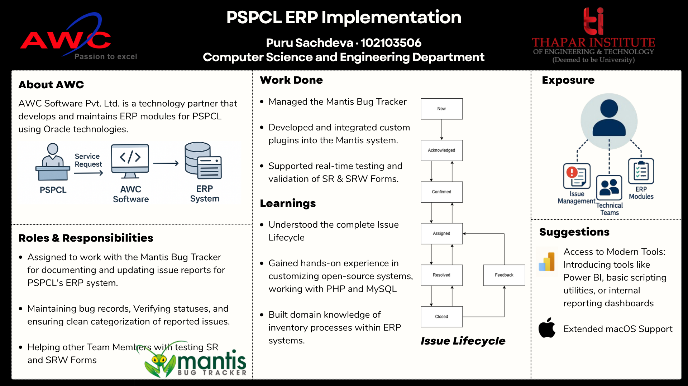

# 🛠️ ERP Issue Tracker – Cloud Migration Project (AWC Software)

## 📌 Overview

This project was developed during my Software Engineering internship at AWC Software as part of a cloud migration initiative transitioning from an in-house system to Oracle Cloud for PSPCL (Punjab State Power Corporation Limited).

The objective was to design and implement a centralized issue tracking system to streamline bug reporting, tracking, and resolution across ERP modules, specifically focusing on Store Requisition (SR) and Store Return Warrant (SRW) workflows.

---

## 🖼️ Poster

---

## 🚀 Key Highlights

* ✅ Implemented a production-level issue tracking system using MantisBT
* ☁️ Contributed to a cloud migration initiative (In-house → Oracle Cloud)
* 🔄 Streamlined issue lifecycle tracking (report → assign → resolve → reopen)
* 🔌 Developed a custom plugin for automated user watchlists
* 🎨 Improved UI/UX for better usability and accessibility
* 📈 System is currently in active use within the organization

---

## 🧠 Problem Statement

* No centralized platform to track ERP-related issues
* Lack of visibility on issue status (pending, resolved, reopened)
* Delays in resolving bugs related to SR/SRW workflows
* Inefficient collaboration between client (PSPCL) and development team

---

## ✅ Solution

* Implemented **Mantis Bug Tracker (MantisBT)** as a centralized issue tracking system
* Enabled structured workflows for reporting, assigning, and resolving issues
* Improved transparency and communication between stakeholders
* Automated tracking and notifications using custom plugins

---

## 🏗️ System Architecture

* **Bug Tracking System:** MantisBT (PHP, MySQL)
* **ERP Integration:** Oracle Forms (SR/SRW Modules)
* **Frontend Enhancements:** HTML, CSS
* **Customization:** Plugin development using PHP

---

## 🔌 Custom Features

### Auto-Watchlist Plugin

* Automatically adds all relevant stakeholders (reporter, assignee, updater) to the issue watchlist
* Built using MantisBT plugin hooks and PHP scripting
* Ensures better communication and visibility across the issue lifecycle

---

## 🎨 UI Enhancements

* Redesigned login and signup pages
* Improved layout, responsiveness, and form usability
* Focused on accessibility and clarity for enterprise users

---

## 📊 Impact

* Centralized issue tracking for ERP workflows
* Faster issue resolution through structured workflows
* Improved collaboration between PSPCL and AWC teams
* Enhanced visibility into issue lifecycle and status

---

## 🛠️ Tech Stack

* **Backend:** PHP
* **Database:** MySQL
* **ERP System:** Oracle ERP (SR/SRW Modules)
* **Frontend:** HTML, CSS
* **Tools:** MantisBT, Plugin Architecture

---

## 🎥 Demo

A demo video of the system is available here:
[Demo Video Link]

---

## 📄 Documentation

A detailed structured report of the project can be found here:
[Report Link]

---

## 💡 Learnings

* Understanding of complete bug lifecycle management
* Hands-on experience with customizing open-source tools
* Exposure to enterprise ERP systems and workflows
* Improved collaboration in real-world client environments

---

## 🤝 Acknowledgements

* AWC Software Pvt. Ltd. for providing the opportunity
* PSPCL for real-world project exposure
* Project mentor and team for guidance and support

---
